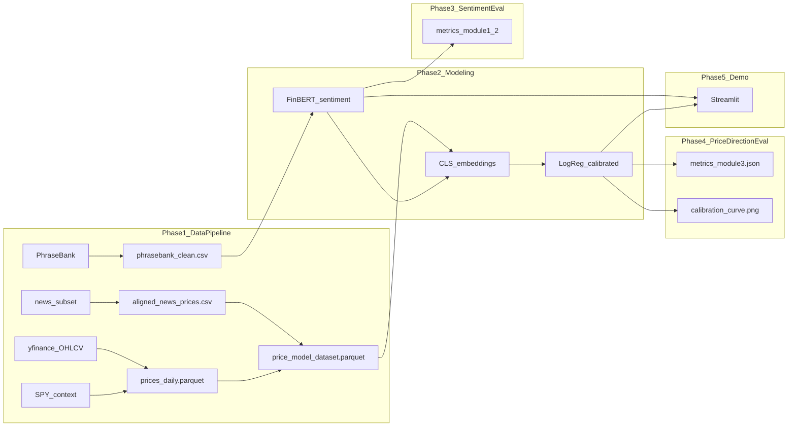

# Financial Sentiment Analysis & Market Trend Prediction

## 1. Project Overview

This project is a **two-stage financial NLP + ML system**:

1. **Stage 1 (sentiment):** Classify headline tone (positive / negative / neutral) using FinBERT fine-tuned on PhraseBank.
2. **Stage 2 (price direction):** Predict **most likely next-day price direction** (Up/Down) with **calibrated probabilities**, using Stage 1 outputs plus market context features.

Two local datasets serve distinct roles:

| Dataset | Path | Rows | Role |
|---------|------|------|------|
| Financial PhraseBank | `data/raw/PhraseBank/data.csv` | 5,842 | Supervised sentiment training and model comparison |
| Daily Financial News (processed analyst ratings) | `data/raw/DailyFinancialNews/analyst_ratings_processed.csv` | ~1.4M | Build price-model dataset and evaluate next-day direction prediction |

**Research question:** Given a headline, ticker, and event-day market state, can we predict whether the stock's **next trading day** close will be above or below the event-day close — and how confident should we be?

**PhraseBank schema:** `Sentence` (text), `Sentiment` (label). Class distribution: neutral 3,130 / positive 1,852 / negative 860.

**News schema:** `title` (headline), `date` (timestamp with timezone), `stock` (ticker symbol).

The advanced sentiment model is **FinBERT** (`yiyanghkust/finbert-tone` on Hugging Face), fine-tuned on PhraseBank. Stage 2 is a calibrated **LogisticRegression** on tabular features (FinBERT probabilities, market context, PCA-reduced CLS embeddings).

---

## 2. System Architecture

The pipeline runs in **5 phases**:

| Phase | Name | Primary outputs |
|-------|------|-----------------|
| 1 | Data pipeline | `phrasebank_clean.csv`, `news_subset.csv`, `prices_daily.parquet`, `spy_prices.parquet`, `aligned_news_prices.csv`, **`price_model_dataset.parquet`** |
| 2 | Modeling | `models/baseline/*`, `models/finbert_finetuned/`, **`models/price_direction/`** |
| 3 | Sentiment evaluation | `metrics_module1.json`, `metrics_module2.json`, confusion matrices |
| 4 | **Price direction evaluation** | `metrics_module3.json`, `confusion_matrix_price_model.png`, `calibration_curve.png` |
| 5 | Deployment | Streamlit demo: sentiment + **next-day direction + confidence** |



---

## 3. Project Structure

```text
financial-sentiment-analysis/
│
├── data/
│   ├── raw/
│   │   ├── PhraseBank/data.csv
│   │   └── DailyFinancialNews/analyst_ratings_processed.csv
│   ├── processed/
│   │   ├── phrasebank_clean.csv
│   │   ├── news_subset.csv
│   │   ├── aligned_news_prices.csv
│   │   └── price_model_dataset.parquet
│   └── external/
│       ├── prices_daily.parquet
│       └── spy_prices.parquet
│
├── notebooks/
│   ├── 01_data_exploration.ipynb
│   └── 02_baseline_testing.ipynb
│
├── src/
│   ├── data_loader.py          # yfinance download (tickers + SPY)
│   ├── preprocess.py           # PhraseBank cleaning
│   ├── align_market.py         # news filtering, same-day price alignment
│   ├── build_price_dataset.py  # forward labels, features, FinBERT probs + CLS
│   ├── finbert_inference.py    # shared FinBERT inference helpers
│   ├── price_constants.py      # Stage 2 feature column definitions
│   ├── train_baseline.py       # TF-IDF + Naive Bayes + SVM
│   ├── train_finbert.py        # FinBERT fine-tuning (Stage 1)
│   ├── train_price_model.py    # calibrated LogReg (Stage 2)
│   ├── inference.py            # Stage 1 + Stage 2 demo inference
│   └── evaluate.py             # sentiment and price-direction metrics
│
├── models/
│   ├── baseline/
│   ├── finbert_finetuned/
│   └── price_direction/
│       ├── pipeline.pkl
│       └── feature_columns.json
│
├── evaluation/
│   ├── metrics_module1.json
│   ├── metrics_module2.json
│   ├── metrics_module3.json
│   └── figures/
│       ├── confusion_matrix_price_model.png
│       └── calibration_curve.png
│
├── app/app.py
├── config.yaml
├── requirements.txt
└── README.md
```

All hyperparameters and paths are defined in `config.yaml` (single source of truth).

---

## 4. Phase 1 — Data Pipeline

### 4.1 PhraseBank preprocessing (`src/preprocess.py`)

**Input:** `data/raw/PhraseBank/data.csv`

**Text cleaning** (identical for baseline and FinBERT):

1. Strip HTML tags and URLs
2. Convert to lowercase
3. Remove non-alphabetic characters
4. Collapse whitespace
5. Drop rows with null or empty text

Stop words are **not** removed at this stage. English stop words are applied only inside the TF-IDF vectorizer during baseline training.

**Output:** `data/processed/phrasebank_clean.csv` with columns `Sentence`, `Sentiment`, `cleaned_text`.

### 4.2 News subset (`src/align_market.py`)

**Input:** `data/raw/DailyFinancialNews/analyst_ratings_processed.csv`

**Filter criteria:**

- `stock` must be in the top 19 tickers by headline count (BBRY excluded — no yfinance data)
- `date >= 2018-01-01`

**Top 19 tickers (fixed):**

`MRK`, `MS`, `MU`, `NVDA`, `QQQ`, `M`, `EBAY`, `NFLX`, `GILD`, `VZ`, `DAL`, `JNJ`, `QCOM`, `BABA`, `KO`, `ORCL`, `FDX`, `HD`, `WFC`

**Processing steps:**

1. Rename column `title` → `headline`
2. Parse `date` to UTC timestamps; drop rows with unparseable dates
3. Apply the same text cleaning as PhraseBank; store result in `cleaned_text`

**Output:** `data/processed/news_subset.csv`

### 4.3 Price data (`src/data_loader.py` + `src/align_market.py`)

**Source:** `yfinance` daily OHLCV (Open, High, Low, Close, Volume)

**Scope:** 19 tickers above, date range **2018-01-01 to 2020-06-11**

**Cache:** `data/external/prices_daily.parquet` (one row per ticker/date)

Tickers that fail to download are logged and excluded from alignment.

### 4.4 Trading-day alignment (same-day labels for legacy dataset)

1. Convert each news timestamp to a US/Eastern calendar date
2. If the date falls on Saturday or Sunday, shift to the **next Monday** (NYSE next-trading-day rule)
3. Join news rows with price data on `(stock, trading_date)`
4. Compute daily return: `(Close - Open) / Open`
5. Assign same-day price label: `Up` if return > 0, `Down` if return < 0; drop flat/missing rows

**Output:** `data/processed/aligned_news_prices.csv`

### 4.5 SPY market context (`src/data_loader.py`)

- Download **SPY** daily OHLCV for **2018-01-01 to 2020-06-12** (extra day for last forward label)
- Cache: `data/external/spy_prices.parquet`
- Used only as **market context**, not as a prediction ticker

### 4.6 Price model dataset (`src/build_price_dataset.py`)

**Input:**

- `data/processed/aligned_news_prices.csv`
- `data/external/prices_daily.parquet`
- `data/external/spy_prices.parquet`
- Fine-tuned FinBERT at `models/finbert_finetuned/`

**Forward return label (per row):**

For each row with event trading date `t` and ticker `stock`:

1. Look up `Close[t]` and next trading day `Close[t+1]` from `prices_daily.parquet`
2. `forward_return = (Close[t+1] - Close[t]) / Close[t]`
3. Drop rows where `forward_return == 0` or `|forward_return| < 0.001` (0.1% flat band)
4. `forward_direction`: **Up** if `forward_return > 0`, **Down** if `< 0`

**Tabular features (known at end of day `t`):**

| Feature | Definition |
|---------|------------|
| `prob_negative`, `prob_neutral`, `prob_positive` | FinBERT softmax on `cleaned_text` |
| `stock_return_1d` | `(Close[t] - Close[t-1]) / Close[t-1]` |
| `stock_return_5d` | 5-day cumulative close-to-close return ending at `t` |
| `spy_return_1d` | SPY same formula on date `t` |
| `volume_zscore_20d` | Z-score of volume vs 20-day rolling mean for `stock` |
| `day_of_week` | 0–4 (Mon–Fri) from `trading_date` |
| `hour_of_day` | Hour from `news_datetime` (US/Eastern), 0–23 |

**Text embedding feature:**

- FinBERT **`[CLS]`** hidden state (768-dim) per `cleaned_text`, batch size 16
- Stored as `cls_0` … `cls_767` columns; **PCA (768 → 32)** is fit later in `train_price_model.py` on **train split only**

**Output:** `data/processed/price_model_dataset.parquet` (~16k rows after filtering)

---

## 5. Phase 2 — Modeling

### 5.1 Baseline models (`src/train_baseline.py`)

**Input:** `data/processed/phrasebank_clean.csv`

**Features:** `TfidfVectorizer(max_features=5000, stop_words="english")`

**Models:** Multinomial Naive Bayes (`alpha=1.0`), Linear SVM (`kernel="linear"`, `probability=True`)

**Train/test split:** 80/20 stratified random split (`random_state=42`).

**Saved artifacts:** `models/baseline/naive_bayes.pkl`, `svm.pkl`, `tfidf_vectorizer.pkl`

### 5.2 FinBERT — Stage 1 (`src/train_finbert.py`)

**Pretrained model:** `yiyanghkust/finbert-tone`

**Label mapping:** `{neutral: 0, positive: 1, negative: 2}`

| Hyperparameter | Value |
|----------------|-------|
| Batch size | 16 |
| Epochs | 3 |
| Learning rate | 2e-5 |
| Max length | 128 |
| Best checkpoint metric | `macro_f1` |

**Saved artifacts:** `models/finbert_finetuned/` (model weights + tokenizer)

### 5.3 Stage 2 — Price direction model (`src/train_price_model.py`)

**Input:** `data/processed/price_model_dataset.parquet`

**Temporal split (fixed):**

| Set | `trading_date` range |
|-----|----------------------|
| Train | 2018-01-01 – 2019-12-31 |
| Test | 2020-01-01 – 2020-06-11 |

**Feature matrix (41 features):**

1. Stage 1 probs (3)
2. Tabular market features (6)
3. PCA-reduced CLS embedding (32)

**Base estimator:** `LogisticRegression(max_iter=1000, class_weight="balanced", random_state=42)`

**Calibration:** `CalibratedClassifierCV(estimator, method="isotonic", cv=3)` fit on **train only**

**Saved artifacts:**

- `models/price_direction/pipeline.pkl` — `StandardScaler` (tabular + PCA features) + `PCA(32)` + calibrator
- `models/price_direction/feature_columns.json` — column metadata

Training does **not** retrain FinBERT — Stage 1 is frozen; only Stage 2 weights are learned.

---

## 6. Phase 3 — Sentiment Evaluation (`src/evaluate.py --module sentiment`)

Evaluate all three models (Naive Bayes, SVM, FinBERT) on the held-out PhraseBank test set.

**Metrics:** accuracy, macro/weighted precision/recall/F1, per-class metrics, confusion matrices.

**Primary model selection metric:** **macro F1**

**Outputs:**

- `evaluation/metrics_module1.json` — Naive Bayes and SVM
- `evaluation/metrics_module2.json` — FinBERT
- `evaluation/figures/confusion_matrix_{model}.png`

FinBERT is the Stage 1 production model for both the demo and the price pipeline.

---

## 7. Phase 4 — Price Direction Evaluation (`src/evaluate.py --module market`)

Evaluate Stage 2 on the **temporal test set (2020)** only.

### Primary model (Stage 2 calibrated fusion)

- Accuracy, MCC, precision/recall/F1 (Up and Down)
- Confusion matrix (Up/Down)
- **Brier score** and calibration curve for P(Up)
- Mean confidence on correct vs incorrect predictions

### Baselines (same test set)

| Baseline | Rule |
|----------|------|
| `always_up` | Predict Up every time |
| `momentum` | Predict Up if `stock_return_1d > 0`, else Down |
| `sentiment_only` | LogisticRegression on **prob_negative/neutral/positive only** |

**Outputs:**

- `evaluation/metrics_module3.json`
- `evaluation/figures/confusion_matrix_price_model.png`
- `evaluation/figures/calibration_curve.png`

### Limitations

- Predicts **next-day close vs event-day close**, not intraday or causal impact
- Features include same-day returns → correlational, not a trading system
- Calibrated confidence reflects **historical test-period reliability**, not guaranteed future performance
- Headline–ticker mismatch (macro news tagged to a single stock) adds noise

---

## 8. Phase 5 — Streamlit Demo (`app/app.py`)

**Framework:** Streamlit

**Models loaded:** Fine-tuned FinBERT (Stage 1) + calibrated price pipeline (Stage 2)

**UI workflow:**

1. Text area for headline input + **Analyze** button
2. **Ticker select** (top 19) and **trading date** (2018–2020 range)
3. **Stage 1:** sentiment label + probability bars
4. **Stage 2:** predicted next-day direction (`Up`/`Down`), `P(Up)`, `P(Down)`, **confidence** = `max(P(Up), P(Down))`
5. Low-confidence warning if confidence < 0.55
6. Sidebar: ground-truth lookup from `price_model_dataset.parquet` when available

**Run:**

```bash
streamlit run app/app.py
```

### Demo test cases

Use these after starting the demo. Set **ticker** and **date** in the sidebar, paste the headline, click **Analyze**. Check Stage 1 first, then Stage 2, then sidebar ground truth when available. Probabilities may vary slightly (±2%) by environment; directions and labels should match.

**How Stage 2 behaves:** On the 2020 test set the price model averages ~52% confidence and is biased toward **Up**. A low-confidence warning (< 55%) on most inputs is **expected**, not a bug.

#### Part A — Stage 1 sanity checks (clear sentiment)

Write headlines like real financial news (reported events, not speculative forecasts).

| # | Ticker | Date | Headline | Expected Stage 1 | Expected probs (approx.) |
|---|--------|------|----------|------------------|----------------------------|
| A1 | NVDA | 2020-03-16 | Nvidia shares surge after company reports record datacenter revenue growth | positive | pos ≈ 99%, neg ≈ 0%, neu ≈ 0% |
| A2 | MRK | 2019-05-10 | Merck wins FDA approval for new oncology drug candidate | positive | pos ≈ 99% |
| A3 | HD | 2020-04-21 | Home Depot beats earnings estimates and raises outlook for the year | positive | pos ≈ 99% |
| A4 | BABA | 2020-06-10 | Alibaba shares plunge on delisting fears and regulatory crackdown concerns | negative | neg ≈ 89%, pos ≈ 0% |
| A5 | NFLX | 2020-01-15 | Netflix subscriber growth misses analyst expectations in latest quarter | negative | neg ≈ 89% |
| A6 | WFC | 2020-02-05 | Wells Fargo faces heavy fines over sales practice violations | negative | neg ≈ 73%, neu ≈ 25% |
| A7 | JNJ | 2019-08-20 | The company will hold its annual shareholder meeting next month | neutral | neu ≈ 99% |

#### Part B — Stage 2 behavior (low confidence is normal)

| # | Ticker | Date | Headline | Expected Stage 2 |
|---|--------|------|----------|------------------|
| B1 | NVDA | 2020-03-16 | (A1 headline) | Up, conf ≈ 53%, low-confidence warning |
| B2 | BABA | 2020-06-10 | (A4 headline) | Up, conf ≈ 51%, low-confidence warning |
| B3 | KO | 2019-11-08 | Coca Cola reports steady quarterly sales in line with expectations | Down, conf ≈ 51%, low-confidence warning |

Even strong negative sentiment (B2) does not produce high-confidence price predictions.

#### Part C — Real cached headlines (sidebar ground truth)

Paste these **exact** headlines to compare predictions with actual next-day outcomes in the sidebar.

| # | Ticker | Date | Headline (paste exactly) | Expected Stage 1 | Actual next day (sidebar) | Stage 2 (approx.) |
|---|--------|------|---------------------------|------------------|---------------------------|-------------------|
| C1 | BABA | 2020-06-10 | How Delisting Chinese Stocks Could Hurt Wall Street | negative (neg ≈ 82%) | Down (−3.8%) | Up ~51% |
| C2 | NVDA | 2020-02-20 | Shares of several semiconductor companies are trading lower potentially on coronavirus fears | negative (neg ≈ 54%, neu ≈ 45%) | Down (−4.7%) | Up ~51% |
| C3 | NFLX | 2019-07-18 | 'Lion King' Release Might Be A Good Time To Look At Disney's Stock | positive (pos ≈ 94%) | Down (−3.1%) | Up ~51% |

These cases show that **sentiment ≠ next-day price**. Macro or mismatched headlines (C3) add noise.

#### Part D — Gotcha cases (what not to expect)

| # | Ticker | Date | Headline | What happens | Lesson |
|---|--------|------|----------|--------------|--------|
| D1 | BABA | 2020-06-10 | BABA stock price is determined to rise in the upcoming days as a result of the Chinese government's new policies | neutral (~61%), not positive | Speculative / forecast wording → neutral |
| D2 | BABA | 2020-06-10 | Alibaba shares surge on new Chinese government policies | positive (~99%) | Same idea, news-style phrasing → positive |
| D3 | Any | Any | Very bullish custom headline | Stage 2 still ~51–53% conf | Stage 2 does not mirror human certainty |

Compare **D1 vs D2** side-by-side: same story, different wording.

#### Suggested 5-minute demo flow

1. **A1** — Stage 1 strong positive
2. **A4** — Stage 1 strong negative
3. **A7** — neutral detection
4. **C1** — negative sentiment + sidebar Down ground truth, but Stage 2 still ~51% Up with warning
5. **D1 vs D2** — phrasing matters for sentiment
6. **B3 (KO)** — optional: Stage 2 picks Down (still low confidence)

#### Checklist

- [ ] Stage 1 label matches expected for A1–A7
- [ ] Stage 2 confidence is almost always < 55% → warning appears
- [ ] C1 sidebar shows actual Down despite Stage 2 saying Up
- [ ] D1 is neutral, D2 is positive (same theme, different style)
- [ ] Stage 2 is not treated as “almost certain” on bullish headlines

---

## 9. Configuration (`config.yaml`)

```yaml
data:
  phrasebank_path: "data/raw/PhraseBank/data.csv"
  news_path: "data/raw/DailyFinancialNews/analyst_ratings_processed.csv"
  aligned_news_prices_path: "data/processed/aligned_news_prices.csv"
  prices_daily_path: "data/external/prices_daily.parquet"
  spy_prices_path: "data/external/spy_prices.parquet"
  price_model_dataset_path: "data/processed/price_model_dataset.parquet"
  news_start_date: "2018-01-01"
  news_tickers: [MRK, MS, MU, NVDA, QQQ, M, EBAY, NFLX, GILD, VZ, DAL, JNJ, QCOM, BABA, KO, ORCL, FDX, HD, WFC]
  price_start_date: "2018-01-01"
  price_end_date: "2020-06-11"
  spy_end_date: "2020-06-12"
  forward_flat_threshold: 0.001
  price_train_end_date: "2019-12-31"
  price_test_start_date: "2020-01-01"
  random_seed: 42

models:
  finbert:
    pretrained_model: "yiyanghkust/finbert-tone"
    max_length: 128
    batch_size: 16
    save_path: "models/finbert_finetuned/"
  price_direction:
    save_path: "models/price_direction/"
    pca_components: 32
    logistic_c: 1.0
    calibration_method: "isotonic"
    calibration_cv: 3
    confidence_threshold: 0.55

evaluation:
  metrics_module3_path: "evaluation/metrics_module3.json"
  figures_path: "evaluation/figures/"
```

---

## 10. Tech Stack and Setup

### Requirements

- **Language:** Python 3.9+
- **Packages** (`requirements.txt`): `numpy`, `pandas`, `scikit-learn`, `torch`, `transformers`, `accelerate`, `yfinance`, `matplotlib`, `seaborn`, `streamlit`, `pyyaml`, `python-dotenv`, `tqdm`, `sentencepiece`, `joblib`, `pyarrow`

### Setup

```bash
python -m venv .venv
# Windows
.venv\Scripts\activate
# macOS/Linux
source .venv/bin/activate

pip install -r requirements.txt
```

Place raw data at:

- `data/raw/PhraseBank/data.csv`
- `data/raw/DailyFinancialNews/analyst_ratings_processed.csv`

Notebooks are for interactive EDA only. The production pipeline runs via `src/` scripts.

---

## 11. Execution Order

Run scripts from the project root in this order:

```bash
# Phase 1 — Data pipeline
python src/preprocess.py
python src/align_market.py
python src/build_price_dataset.py

# Phase 2 — Modeling
python src/train_baseline.py        # optional for Phase 3 comparison
python src/train_finbert.py         # Stage 1 (required)
python src/train_price_model.py     # Stage 2

# Phase 3 — Sentiment evaluation
python src/evaluate.py --module sentiment

# Phase 4 — Price direction evaluation
python src/evaluate.py --module market

# Phase 5 — Demo
streamlit run app/app.py
```

**Note:** `build_price_dataset.py` runs FinBERT inference and CLS embedding extraction on ~16k rows; allow several minutes on CPU.
