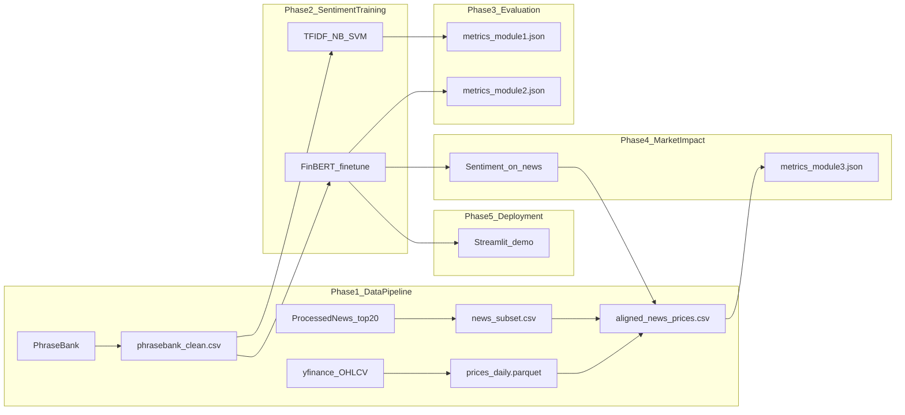

# Financial Sentiment Analysis & Market Trend Prediction

## 1. Project Overview

This project builds a **3-class financial sentiment classifier** (positive, negative, neutral) and measures whether predicted sentiment aligns with **same-day stock price direction** on real news headlines.

Two local datasets serve distinct roles:

| Dataset | Path | Rows | Role |
|---------|------|------|------|
| Financial PhraseBank | `data/raw/PhraseBank/data.csv` | 5,842 | Supervised sentiment training and model comparison |
| Daily Financial News (processed analyst ratings) | `data/raw/DailyFinancialNews/analyst_ratings_processed.csv` | ~1.4M | Apply the best model and evaluate sentiment vs. price movement |

**PhraseBank schema:** `Sentence` (text), `Sentiment` (label). Class distribution: neutral 3,130 / positive 1,852 / negative 860.

**News schema:** `title` (headline), `date` (timestamp with timezone), `stock` (ticker symbol).

The advanced model is **FinBERT** (`yiyanghkust/finbert-tone` on Hugging Face), a BERT variant pre-trained on financial text and fine-tuned on PhraseBank for 3-class sentiment classification.

---

## 2. System Architecture

The pipeline runs in **5 phases**:

| Phase | Name | Primary outputs |
|-------|------|-----------------|
| 1 | Data pipeline | `data/processed/phrasebank_clean.csv`, `news_subset.csv`, `data/external/prices_daily.parquet`, `aligned_news_prices.csv` |
| 2 | Sentiment modeling | `models/baseline/*`, `models/finbert_finetuned/` |
| 3 | Sentiment evaluation | `evaluation/metrics_module1.json`, `metrics_module2.json`, confusion matrices in `evaluation/figures/` |
| 4 | Market impact evaluation | `evaluation/metrics_module3.json`, `evaluation/figures/sentiment_vs_price.png` |
| 5 | Deployment | Streamlit demo at `app/app.py` |



---

## 3. Project Structure

```text
financial-sentiment-analysis/
│
├── data/
│   ├── raw/
│   │   ├── PhraseBank/
│   │   │   └── data.csv
│   │   └── DailyFinancialNews/
│   │       └── analyst_ratings_processed.csv
│   ├── processed/
│   │   ├── phrasebank_clean.csv
│   │   ├── news_subset.csv
│   │   └── aligned_news_prices.csv
│   └── external/
│       └── prices_daily.parquet
│
├── notebooks/
│   ├── 01_data_exploration.ipynb
│   └── 02_baseline_testing.ipynb
│
├── src/
│   ├── __init__.py
│   ├── data_loader.py          # yfinance download and caching
│   ├── preprocess.py           # PhraseBank cleaning
│   ├── align_market.py         # news filtering, price alignment, Up/Down labels
│   ├── train_baseline.py       # TF-IDF + Naive Bayes + SVM
│   ├── train_finbert.py        # FinBERT fine-tuning
│   └── evaluate.py             # sentiment and market impact metrics
│
├── models/
│   ├── baseline/
│   │   ├── naive_bayes.pkl
│   │   ├── svm.pkl
│   │   └── tfidf_vectorizer.pkl
│   └── finbert_finetuned/
│
├── evaluation/
│   ├── metrics.json
│   ├── metrics_module1.json
│   ├── metrics_module2.json
│   ├── metrics_module3.json
│   └── figures/
│
├── app/
│   └── app.py
│
├── config.yaml
├── .env
├── .gitignore
├── requirements.txt
└── README.md
```

All hyperparameters and paths are defined in `config.yaml` (single source of truth).

---

## 4. Phase 1 — Data Pipeline

### 4.1 PhraseBank preprocessing (`src/preprocess.py`)

**Input:** `data/raw/PhraseBank/data.csv`

**Text cleaning** (identical for baseline and FinBERT):

1. Strip HTML tags and URLs
2. Convert to lowercase
3. Remove non-alphabetic characters
4. Collapse whitespace
5. Drop rows with null or empty text

Stop words are **not** removed at this stage. English stop words are applied only inside the TF-IDF vectorizer during baseline training.

**Output:** `data/processed/phrasebank_clean.csv` with columns `Sentence`, `Sentiment`, `cleaned_text`.

### 4.2 News subset (`src/align_market.py`)

**Input:** `data/raw/DailyFinancialNews/analyst_ratings_processed.csv`

**Filter criteria:**

- `stock` must be in the top 20 tickers by headline count in the full file
- `date >= 2018-01-01`

**Top 20 tickers (fixed):**

`MRK`, `MS`, `MU`, `NVDA`, `QQQ`, `M`, `EBAY`, `NFLX`, `GILD`, `VZ`, `DAL`, `JNJ`, `QCOM`, `BABA`, `KO`, `ORCL`, `FDX`, `HD`, `WFC`, `BBRY`

This yields approximately **17,292 rows** (from ~1.4M total).

**Processing steps:**

1. Rename column `title` → `headline`
2. Parse `date` to UTC timestamps; drop rows with unparseable dates (~0.2%)
3. Apply the same text cleaning as PhraseBank; store result in `cleaned_text`

**Output:** `data/processed/news_subset.csv`

### 4.3 Price data (`src/data_loader.py` + `src/align_market.py`)

**Source:** `yfinance` daily OHLCV (Open, High, Low, Close, Volume)

**Scope:** 20 tickers above, date range **2018-01-01 to 2020-06-11**

**Cache:** `data/external/prices_daily.parquet` (one row per ticker/date)

Tickers that fail to download are logged and excluded from alignment.

### 4.4 Trading-day alignment and Up/Down labels

1. Convert each news timestamp to a US/Eastern calendar date
2. If the date falls on Saturday or Sunday, shift to the **next Monday** (NYSE next-trading-day rule)
3. Join news rows with price data on `(stock, trading_date)`
4. Compute daily return: `(Close - Open) / Open`
5. Assign price label:
   - `Up` if return > 0
   - `Down` if return < 0
   - Drop rows where return == 0 or price data is missing

**Output:** `data/processed/aligned_news_prices.csv` with columns:

`headline`, `stock`, `news_datetime`, `trading_date`, `daily_return`, `price_direction`, `cleaned_text`

---

## 5. Phase 2 — Sentiment Modeling

### 5.1 Baseline models (`src/train_baseline.py`)

**Input:** `data/processed/phrasebank_clean.csv`

**Features:** `TfidfVectorizer(max_features=5000, stop_words="english")`

**Models:**

| Model | Configuration |
|-------|---------------|
| Multinomial Naive Bayes | `alpha=1.0` |
| Linear SVM | `kernel="linear"`, `probability=True`, `random_state=42` |

**Train/test split:** 80/20 **stratified random** split (`random_state=42`). Stratified random split is used because PhraseBank has no timestamps.

**Saved artifacts:**

- `models/baseline/naive_bayes.pkl`
- `models/baseline/svm.pkl`
- `models/baseline/tfidf_vectorizer.pkl`

### 5.2 FinBERT (`src/train_finbert.py`)

**Pretrained model:** `yiyanghkust/finbert-tone` (Hugging Face)

**Label mapping:** `{neutral: 0, positive: 1, negative: 2}`

**Tokenization:** `max_length=128`, truncate and pad

**Training:** Hugging Face `Trainer` with **full fine-tuning** (all layers updated; no layer freezing)

| Hyperparameter | Value |
|----------------|-------|
| Batch size | 16 |
| Epochs | 3 |
| Learning rate | 2e-5 |
| Evaluation strategy | Per epoch |
| Best checkpoint metric | `macro_f1` |
| Mixed precision | `fp16=True` when CUDA is available |

**Train/test split:** Same 80/20 stratified random split and text cleaning as baseline.

**Saved artifacts:** `models/finbert_finetuned/` (model weights + tokenizer)

---

## 6. Phase 3 — Sentiment Evaluation (`src/evaluate.py --module sentiment`)

Evaluate all three models (Naive Bayes, SVM, FinBERT) on the held-out PhraseBank test set.

**Metrics recorded for each model:**

- Accuracy
- Macro and weighted precision, recall, F1
- Per-class precision, recall, F1, support

**Primary model selection metric:** **macro F1** (accounts for class imbalance; the negative class is the minority in PhraseBank).

**Outputs:**

- `evaluation/metrics_module1.json` — Naive Bayes and SVM
- `evaluation/metrics_module2.json` — FinBERT
- `evaluation/figures/confusion_matrix_{model}.png` — one plot per model
- `evaluation/metrics.json` — merged summary written by `evaluate.py`

**Downstream model:** FinBERT is used for Phases 4 and 5. Reference results from an initial run: ~79.6% accuracy and ~0.73 macro F1, compared to ~68–70% accuracy for baselines.

---

## 7. Phase 4 — Market Impact Evaluation (`src/evaluate.py --module market`)

Run FinBERT inference on all rows in `news_subset.csv` (batch size 16). Add columns:

- `predicted_sentiment`
- `prob_negative`, `prob_neutral`, `prob_positive`

Merge predictions with `aligned_news_prices.csv`.

### Directional mapping

| Predicted sentiment | Mapped price direction |
|-------------------|------------------------|
| positive | Up |
| negative | Down |
| neutral | Excluded from directional accuracy |

### Metrics (`evaluation/metrics_module3.json`)

- **Directional agreement rate** — fraction of non-neutral predictions where mapped direction matches actual `price_direction`
- **Confusion matrix** — predicted direction vs. actual `price_direction` (Up/Down only)
- **Matthews correlation coefficient (MCC)** — balanced measure for binary directional agreement
- **Breakdown by year** — 2018, 2019, 2020

**Plot:** `evaluation/figures/sentiment_vs_price.png` (heatmap of predicted vs. actual direction)

### Limitations

This phase measures **same-day open-to-close co-movement** between headline sentiment and price direction. It does **not** establish causal impact of news on prices. Many confounding factors (market-wide moves, prior momentum, unrelated events) affect daily returns. Neutral predictions are excluded from directional accuracy because they carry no bullish/bearish signal under the mapping above; the README reports the count of excluded neutral rows alongside directional metrics.

---

## 8. Phase 5 — Streamlit Demo (`app/app.py`)

**Framework:** Streamlit

**Model loaded:** Fine-tuned FinBERT from `models/finbert_finetuned/`

**UI workflow:**

1. Text area for headline input
2. **Analyze** button → predicted sentiment label and per-class probability bars
3. Sidebar: select ticker (from the top-20 list) and date → display cached `daily_return` and `price_direction` if a matching row exists in `aligned_news_prices.csv`

**Run:**

```bash
streamlit run app/app.py
```

---

## 9. Configuration (`config.yaml`)

```yaml
data:
  raw_path: "data/raw/"
  processed_path: "data/processed/"
  external_path: "data/external/"
  phrasebank_path: "data/raw/PhraseBank/data.csv"
  news_path: "data/raw/DailyFinancialNews/analyst_ratings_processed.csv"
  news_start_date: "2018-01-01"
  news_tickers:
    - MRK
    - MS
    - MU
    - NVDA
    - QQQ
    - M
    - EBAY
    - NFLX
    - GILD
    - VZ
    - DAL
    - JNJ
    - QCOM
    - BABA
    - KO
    - ORCL
    - FDX
    - HD
    - WFC
    - BBRY
  price_start_date: "2018-01-01"
  price_end_date: "2020-06-11"
  train_split: 0.8
  random_seed: 42

models:
  baseline:
    tfidf_max_features: 5000
    svm_kernel: "linear"
    naive_bayes_alpha: 1.0
    save_path: "models/baseline/"

  finbert:
    pretrained_model: "yiyanghkust/finbert-tone"
    max_length: 128
    batch_size: 16
    epochs: 3
    learning_rate: 2.0e-5
    save_path: "models/finbert_finetuned/"

evaluation:
  metrics_path: "evaluation/metrics.json"
  metrics_module1_path: "evaluation/metrics_module1.json"
  metrics_module2_path: "evaluation/metrics_module2.json"
  metrics_module3_path: "evaluation/metrics_module3.json"
  figures_path: "evaluation/figures/"
```

---

## 10. Tech Stack and Setup

### Requirements

- **Language:** Python 3.9+
- **Packages** (`requirements.txt`): `numpy`, `pandas`, `scikit-learn`, `torch`, `transformers`, `accelerate`, `yfinance`, `matplotlib`, `seaborn`, `streamlit`, `pyyaml`, `python-dotenv`, `tqdm`, `sentencepiece`

### Setup

```bash
python -m venv .venv
# Windows
.venv\Scripts\activate
# macOS/Linux
source .venv/bin/activate

pip install -r requirements.txt
```

Place raw data at:

- `data/raw/PhraseBank/data.csv`
- `data/raw/DailyFinancialNews/analyst_ratings_processed.csv`

Notebooks (`notebooks/01_data_exploration.ipynb`, `notebooks/02_baseline_testing.ipynb`) are for interactive EDA only. The production pipeline runs via `src/` scripts.

---

## 11. Execution Order

Run scripts from the project root in this order:

```bash
# Phase 1 — Data pipeline
python src/preprocess.py
python src/align_market.py

# Phase 2 — Sentiment modeling
python src/train_baseline.py
python src/train_finbert.py

# Phase 3 & 4 — Evaluation
python src/evaluate.py --module sentiment
python src/evaluate.py --module market

# Phase 5 — Demo
streamlit run app/app.py
```
